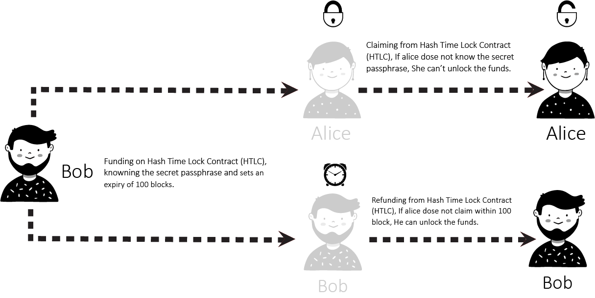
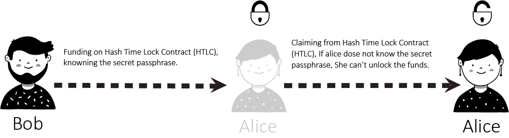

===============
What is a HTLC?
===============
A Hash Time Lock contract (HTLC) is essentially a type of payment in which two people
agree to a financial arrangement where one party will pay the other party a certain
amount of Cryptocurrency, such as Bitcoin or Bytom assets. However, because these
contracts are Time Locked, the receiving party only has a certain amount of time to
accept the payment, otherwise the money can be returned to the sender.

Hash time lock contracts can help to eliminate the need for third parties in contracts
between two parties. Third parties that are often involved in contracts are lawyers,
banks, etc. Lawyers are often required to draw up contracts, and banks are often
required to help store money and then transfer it to the receiving party in the contract.

With hash time lock contracts, two parties could hypothetically set up contracts and
transfer money without the need for third parties. This is because the sending party
could create the conditional payment, and then the receiving party could agree to it,
receive it, and help validate the transaction in the process.

This could potentially revolutionize the way that many businesses interact with one another
and dramatically speed up the time that it takes for business deals to be set up.

How do HTLC work?
=================
The way that Hash Time Lock Contracts work is that the person who will be making the payment
sets up a specific hash, which represents the amount of money that will be paid. To receive
the payment, the recipient will have to create a cryptographic proof of payment, and he or
she will have to do this within the specified amount of time. The amount of time that the
recipient has to accept the payment can vary significantly from one Time Locked contract to
the next. If the recipient meets the deadline, then the money will be theirs, if he or she
fails to meet the deadline, it won’t. So, there is an often a lot at stake when it comes to
meeting deadlines from hash Time Locked contracts, when Cryptocurrencies are being exchanged.

A Hash Time Lock Contract or HTLC is a class of payments that uses Hash Locked and Time Locked
to require that the receiver of a payment either acknowledge receiving the payment prior to a
deadline by generating cryptographic proof of payment or forfeit the ability to claim the payment,
returning(refunding) it to the payer.

Hash Time Lock Contracts (HTLCs) allow payments to be securely routed across multiple payment
channels which is super important because it is not optimal for a person to open a payment channel
with everyone he/she is transacting with.

Hash Locked
-----------
A Hash Locked functions like “two-factor authentication” (2FA). It requires the intended recipient
to provide the correct secret passphrase to claim the funds.

Time Locked
-----------
A Time Locked adds a “timeout” expiration date to a payment. It requires the intended recipient to
claim the funds prior to the expiry. Otherwise, the transaction defaults to enabling the original
sender of funds to claim a refund.

.. image:: static/png/Time-Locked-Contract.png
   :alt: Time Locked Contract (TLC)

Benefits of HTLC's
==================
There are many benefits to these types of contracts. First, because they are time sensitive, it
prevents the person who is making the payment from having to wait indefinitely to find out whether
or not his or her payment goes through. Second, the person who makes the payment will not have to
waste his or her money if the payment is not accepted. It will simply be returned.

Time Sensitivity
----------------
The time sensitive nature of the transaction prevents the sender from having to wait forever to find
out whether their payment went through. If the time runs out, the funds will just be sent back to the
sender, so they don’t have to worry and can wait for the process to unfold.

Trustless system
----------------
As is the case with all smart contracts, trust is not needed as the rules are already coded into the
contract itself. Hash Time Lock Contracts take this one step further by implementing a time limit for
recipients to acknowledge the payment.

Validation of the Blockchain
----------------------------
Transactions are validated because of the cryptographic proof of payment required by the receiver.

Private Information's
---------------------
There are no complicated account setups or KYC/AML restrictions. Trade directly from your wallet
with a counterparty of your choice. Only the parties involved know the details of the trade.

Trading across multiple Cryptocurrencies
----------------------------------------
HTLC makes Cross-chain transactions easier and more secure than ever. Cross chain transactions are the
next step in the evolution of Cryptocurrency adoption. The easier it becomes to unite the hundreds of
blockchain's that currently exist in silos, the faster the technology as a whole can begin to scale and
achieve mass adoption.
